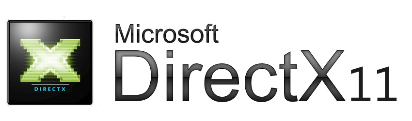

# DirectX11-Course



Project generated while doing Sections 4-8 of the Udemy course  [The Complete Course of Microsoft DirectX 2024](https://www.udemy.com/course/directx-course/) by The Tech Courses.

The ['main' branch](https://github.com/AaronRuizMoraUK/DirectX11-Course/tree/main) contains a **Rendering Engine using DirectX 11** built from scratch.

The ['SimpleRenderer' branch](https://github.com/AaronRuizMoraUK/DirectX11-Course/tree/SimpleRenderer) contains a
**Simple DirectX 11 Renderer** that was generated during Sections 1-3 of the course.

## Build and Run

Requirements
- Graphics card with DirectX 11 support
- Microsoft Windows 
- Microsoft Visual Studio 2022
- CMake 3.28

Steps
- Clone repo
  ````
  git clone https://github.com/AaronRuizMoraUK/DirectX11-Course.git
  ````
- Generate Visual Studio solution using CMake in `build` folder
  ```` 
  cd DirectX11-Course
  mkdir build
  cd build
  cmake .. -G "Visual Studio 17 2022"
  ````
- Open `DirectX11-Course.sln` with Visual Studio
- Build and run `main` project

## Controls

Camera can be controlled while pressing the **right mouse button**:

- Use `WSAD` keys to move forward, backwards and sideways.
- Use `QE` keys to move upward and downwards
- Use mouse to rotate and pitch the camera.
- Use mouse wheel to speed up/down camera movement.

## 3rdParty Libraries

- **[glfw](https://github.com/glfw/glfw.git)**: Provides a simple, platform-independent API for creating windows, contexts and surfaces, reading input, handling events, etc.
- **[mathfu](https://github.com/google/mathfu.git)**: Provides a simple and efficient math library with vectors, matrices and quaternions classes.
- **[stb](https://github.com/nothings/stb.git)**: Provides several single-file graphics and audio libraries for C/C++. Used for image loading.
